# 🍽️ BiteSmart – Flutter + Firebase Food Delivery App

**BiteSmart** is a modern food delivery mobile app for single-restaurant use.  
Built with **Flutter** and **Firebase**, it supports real-time ordering, driver tracking, admin stock control, push notifications, and role-based access.

---

## 👥 Roles & Permissions

### 👤 Customer
- Browse food by category
- Add to cart and place orders
- Track delivery live
- View previous orders
- Contact support via in-app chatbot

### 🚚 Driver
- View assigned deliveries
- Mark deliveries as completed
- Automatically unavailable while assigned
- Receive push notifications for new assignments

### 🛠️ Admin
- View and assign orders to available drivers
- Monitor order and delivery status
- Create new driver accounts
- Manage stock and reset it daily

---

## 🧠 Features Overview

### 🛒 Real-Time Ordering
- Customers place orders directly from the food menu
- Firestore reflects changes instantly
- Admin and driver screens update live

### 📍 Driver Tracking
- Driver’s location updates in real-time
- Customers can track from order history

### 🔔 Notifications
- Admin → Driver: “New Order Assigned”
- Driver → Customer: “Order Delivered”

### 📦 Stock Management
- Each item has:
  - `stock`: current quantity
  - `defaultStock`: resets daily
- Users cannot order if item is out of stock

### 🛡️ Role-based UI
- Authentication with Firebase
- Role (admin, driver, customer) stored in Firestore
- UI & logic auto-adjust based on role

---

## 🗃️ Firestore Structure

```plaintext
users/
  {uid} → name, role, email, fcmToken

orders/
  {orderId} → items[], customerId, driverId, status, time


drivers/
  {uid} → name, isAvailable

food/
  {foodId} → name, price, stock, defaultStock, category, image
```
## 📸 Screenshots

<details>
<summary>🧑 Customer Screens</summary>

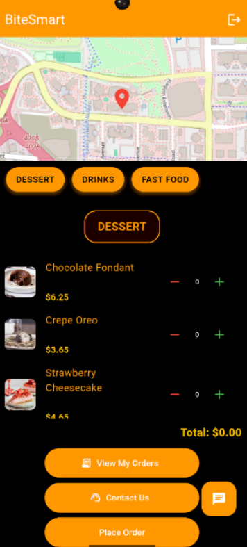  
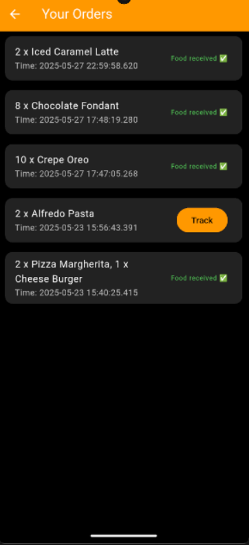  
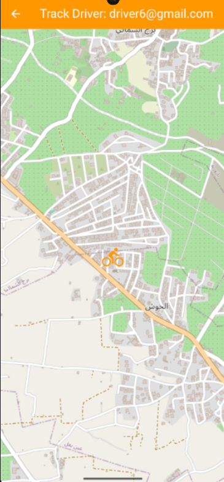  
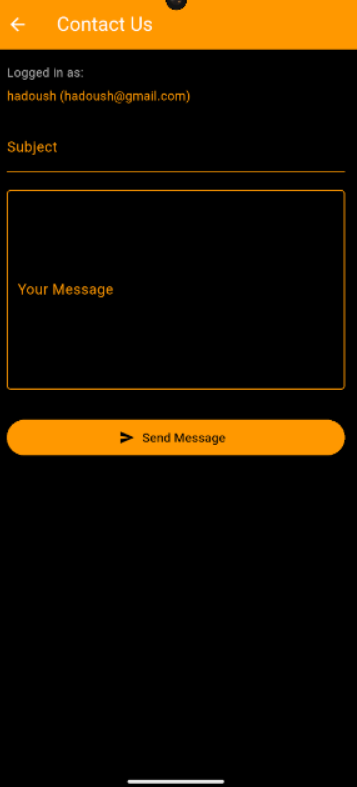

</details>

<details>
<summary>🧑‍✈️ Driver Screens</summary>

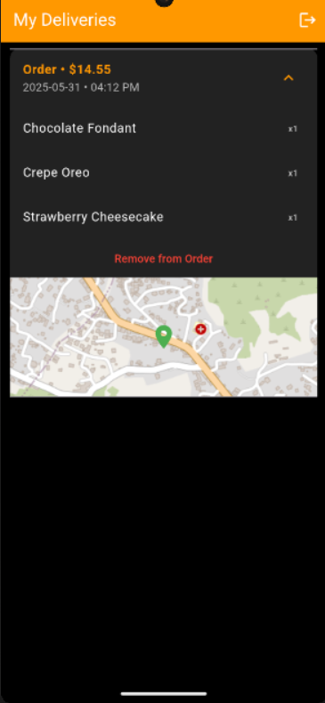

</details>

<details>
<summary>🛠️ Admin Screens</summary>

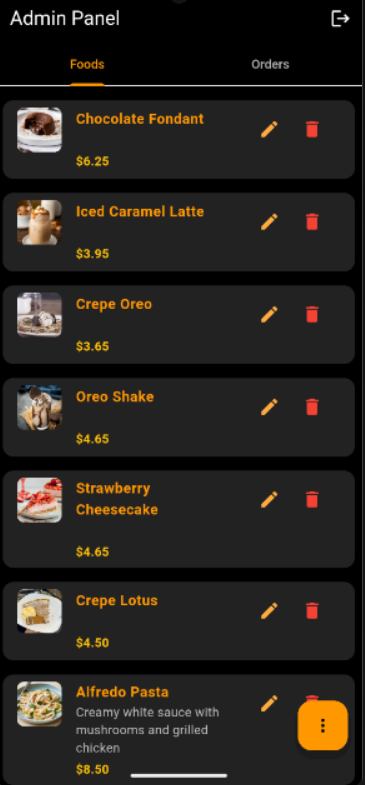  
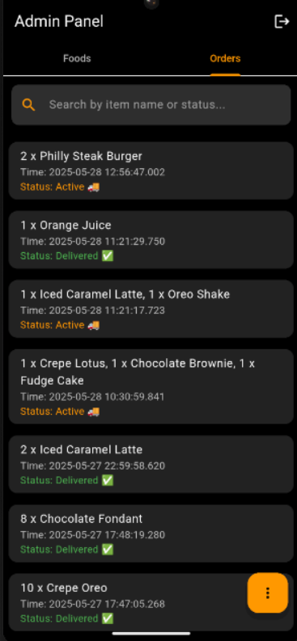  
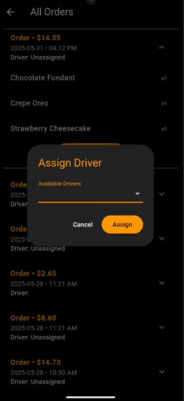  
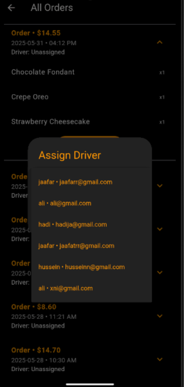  
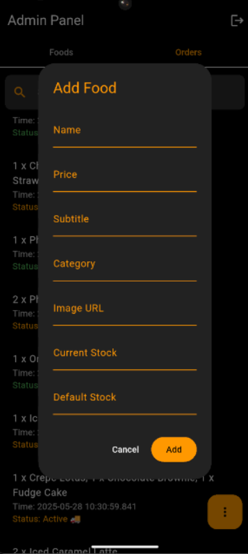  
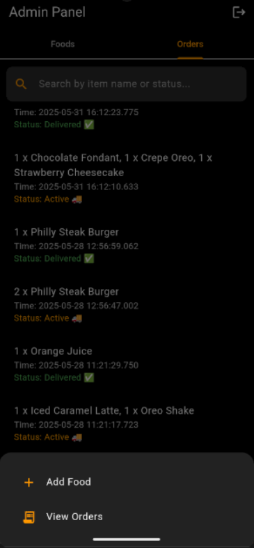  
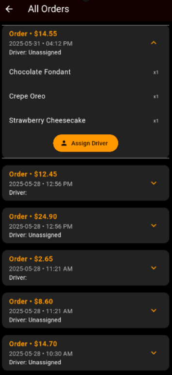

</details>

<details>
<summary>🔐 Authentication Screens</summary>

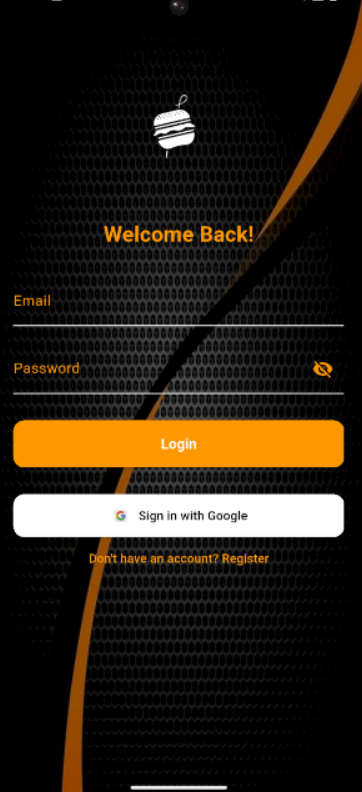  
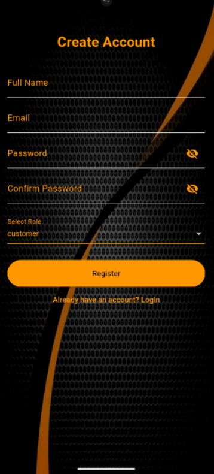  
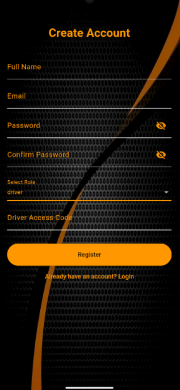  
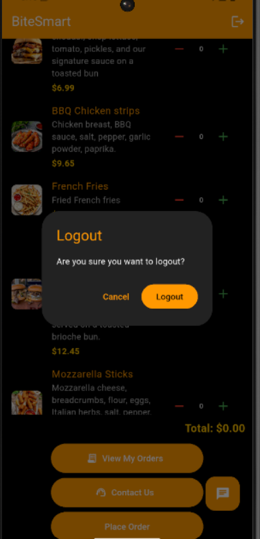

</details>
